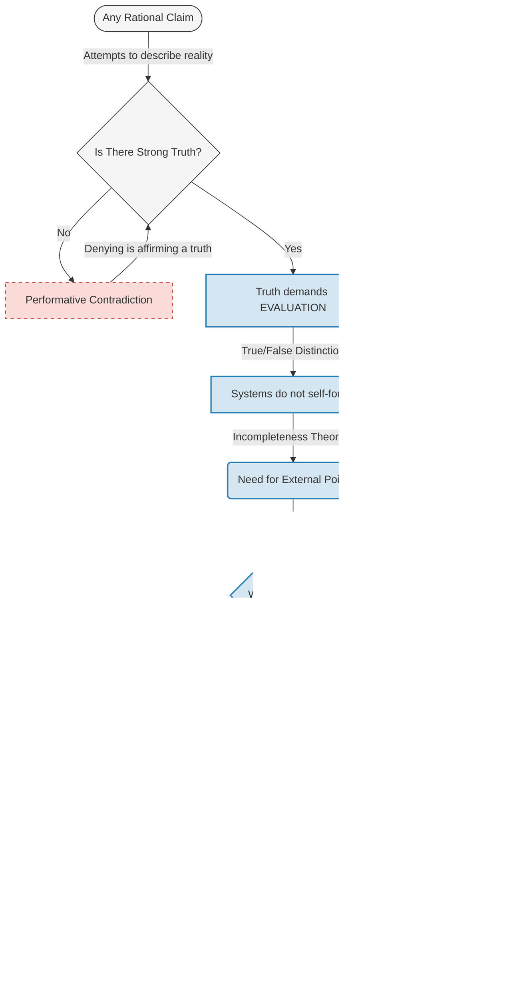

# That Which Evaluates Without Being Evaluated

> This argument operates at the **meta-ontological level**: it does not discuss truths within formal systems, but the **conditions of possibility of any evaluative system**.

### Argument Map

The text that follows develops in five movements: (1) the logical pattern of self-reference is established through classical paradoxes; (2) it is demonstrated that this pattern applies to the very negation of an ultimate normative truth; (3) the characteristics of the foundation that makes evaluation possible are derived through transcendental necessity; (4) the most frequent objections are answered; (5) the ontological consequences of the argumentation are extracted.

Let us begin with the genealogy of the problem.

## The Liar Paradox

**Epimenides of Crete** formulated the oldest known version of this paradox by saying that *"All Cretans are liars"* in the 6th century BC, introducing the problem of normative self-reference.

The paradox, as an explicit logical problem, is normally attributed to **Eubulides of Miletus** in the 4th century BC, who distilled it into the canonical form: *"This sentence is false."*

This proposition establishes itself as a paradox because being false, it is true, and being true, it is false — in effect, equating the expression itself with its negation.

**Aristotle**, in *Metaphysics* and *On Sophistical Refutations*, without solving the paradox, establishes **fundamental categorical distinctions** that would enable the systematic analysis of these self-reference problems, notably the separation between different levels of discourse.

The **Stoics** transform the problem into a **rigorous test of propositional logic's coherence**, taking it very seriously as a theoretical challenge. This attitude motivates the refined analysis of the notion of *lekton* (sayable content), anticipating modern semantic concerns.

In the Middle Ages, logicians such as **Peter of Spain** and **William of Ockham** develop **technical solutions** (negation of full meaning, semantic distinctions), treating the paradox as a legitimate logical problem, not merely rhetorical play.

In the 20th century, the paradox becomes central to mathematical logic and the foundations of mathematics:

- **Bertrand Russell** identifies it as a **symptom of structural inconsistency** linked to unrestricted self-reference, motivating Type Theory.

- **Alfred Tarski** proposes the **hierarchy of languages** (object language vs. metalanguage) as a solution, establishing that the truth of a language can only be defined in a higher metalanguage.

- **Kurt Gödel** uses an **arithmetized analogous structure** to prove the incompleteness theorems, demonstrating that any sufficiently expressive formal system contains undecidable propositions.

## Halting Problem

**Alan Turing** translates the same scheme to machines by asking:
> Is there a general procedure that decides whether any program halts?

The computational formulation offers a pedagogical advantage: it makes the self-reference mechanism explicit in a concrete domain. Let us see how.

Turing constructs a program that:

- Consults this decider,
- And does the opposite of what it predicts about itself.

Something like this:
```
Q(P) {
    if halts(P, P); then
        loop_forever
    else
        halt
    endif
}
```
Then passing the program Q itself as argument P, resulting in something like:
```
Q(Q) does the opposite of itself.
```
At the time, it was decided that there cannot be a decider that can determine whether a program halts or not, because this is paradoxical.

We can, however, formulate a simpler version of the problem:
```
Q(P) {
    return !P(P)
}
```
Which, using logical notation, reveals the essential structure: **Q(P) = ¬P(P)**. The computational formulation has always been an *illustration* of the underlying logical pattern — now made explicit. If we substitute *P* with *Q*, we obtain the expression:

**Q(Q) = ¬Q(Q)**

> **Technical note**: This is not an executable program nor a literal computational definition, but a **diagonalization scheme** — the same logical pattern used by Gödel and Cantor. The expression `Q(Q) = ¬Q(Q)` represents the critical point where a function applies to itself, generating paradoxical self-reference. It does not describe a computable process, but makes explicit the structural impossibility of total self-decision.

What matters is not computational implementability, but the underlying logical pattern: whenever we try to construct a universal decider that includes itself in its own domain, we encounter contradiction.

Here we are left with an expression that equates *something* to its opposite, which is clearly contradiction. Although a universal halting verifier no longer exists, the paradox re-emerges. Why? Because the same problem arises:

**Total, correct, and complete self-evaluation.**

In the case of the liar, the criterion is **truth/falsity**. In the case of the halting problem, the criterion is **halts/does not halt**. In both cases, when the evaluative function is applied to its **own index**, a contradiction arises.

This pattern — the impossibility of total self-evaluation — is not limited to abstract logical or computational problems. It also manifests in contemporary formulations about truth.

## The Transcendent Pattern: From the Impossibility of Self-Foundation

What the liar paradox and halting problem reveal is not a technical limitation of specific systems, but a **structural impossibility of any self-evaluative system**. The logical form is always the same: an evaluator that tries to evaluate itself in its own domain generates contradiction.

This structure applies not only to formal systems, but to any normative claim. When someone says "there is no absolute truth" or "truth is subjective," they are trying to found a proposition — which denies the possibility of foundation — upon the very lack of foundation. The negation of ultimate normativity is itself a normative act that destroys itself.

This is the pattern we will follow: to show that total self-evaluation is impossible, that all evaluation presupposes an external foundation, and to derive the necessary characteristics of that foundation.

## On Strong Truth

### Precise Definition

To avoid misunderstandings, it is necessary to clarify what is meant by **Strong Truth** in this context. The term does not designate:

- A particular semantic theory (correspondence, coherence, pragmatic)
- A specific ontology about the nature of facts
- A philosophical position on the accessibility or knowability of truth

**Strong Truth** designates exclusively the following thesis:

> **There exists at least one proposition whose negation implies performative contradiction** — that is, whose negation makes the very act of negating it incoherent.

In simpler terms: there are truths that cannot be denied without the denial itself self-destructing. This definition is minimal and purely logical-transcendental: it does not state *what* these truths are, only that *there are* truths that function as conditions of possibility of rational discourse itself.

With this clarification, we can proceed.

## The Performative Contradiction of the Negation of Truth

Just as **Epimenides of Crete** declared that "all Cretans are liars" (creating a self-referential paradox), the contemporary negation of ultimate normativity manifests in the proposition: "There is no Strong (absolute) Truth."

This affirmation is not merely a factual error, but a **performative aporia** (contradiction between the content affirmed and the act of affirming it). For the negation to be intelligible and binding, it would have to inhabit the very 'Strong Truth' it seeks to abolish. The utterance thus attempts to suicide its own condition of validity.

The problem here is that the sentence also affirms itself about itself. That is, if there is no truth, then the sentence itself cannot be true. This is called performative contradiction, and another (implicit) form of the **Liar Paradox**.

A popular formulation of this aporia is the affirmation **"Truth is subjective."** The logical error of this position is twofold: first, the affirmation purports to be an *objective* truth about subjectivity; second, it tries to locate normative authority in the empirical individual. Now, the individual, as a biological or psychological object, is a system evaluated by laws (physics, biology, psychology). By saying that truth is subjective, the speaker tries to assign to the 'self' the function of the Ontological Subject — that which evaluates — while simultaneously maintaining it as an evaluated object, resulting in the same self-referential collapse.

This implies that the contrary of the affirmation (in this case *"there is objective truth"*) is necessarily true.

It is postulated, for the same reason, that **Strong Truth Exists** is necessarily true.

**Technical notes:**
1. Any criticism of this conclusion that purports general validity already presupposes exactly the kind of necessary truth here demonstrated, invalidating itself performatively in the very act of formulation.
2. The distinction true/false is already a **minimal normative distinction** — something must be asserted and something rejected — so the foundation of truth is, by logical necessity, also the foundation of normativity.
3. "Strong Truth" does not designate a specific semantic theory, but the impossibility of eliminating the normative distinction true/false without performative incoherence. The argument is independent of any particular analysis of truth, for **all analysis already presupposes a normative criterion of correctness**.
4. The term "necessary" is used here in a strict sense: that whose negation implies **performative impossibility** or impossibility of coherent normative discourse — not psychological necessity nor merely formal necessity, but minimal ontological necessity required by the possibility of rational evaluation.
5. Some philosophers deny that performative contradiction is a decisive refutation, arguing that we can distinguish between the *content* of an affirmation and the *act* of affirming it. However, this objection is only relevant when the content can be evaluated independently of the act. In the present case, the content is precisely about the possibility of normative evaluation — there is no external instance that can validate the negation without already presupposing the normativity it denies. The attempt to escape the contradiction by taking refuge in a "merely descriptive" or "attitudinal" position amounts to abandoning the claim to general validity, converting the objection into silence.

## On the Foundation of Truth

The foundation of truth of a system must be external to that system. Self-foundation is not sustainable.

> The hypothesis of an ultimate "brute fact" does not solve the foundation problem. A brute fact can terminate causal questions, but does not **found normativity**. A foundation that does not explain why evaluation is valid does not found it — it only suspends the rational requirement, which amounts to abandoning the very notion of foundation.

Here we question: **are systems that govern the material world?** And we answer: they govern it as **functioning mechanisms**, but not as **foundations of validity**. A physical system describes the regularity of a process; it does not found the 'correctness' of its own existence nor the obligatoriness of its intelligibility. Confusing *descriptive regularity* (the way things work) with *normative sovereignty* (why the system is true) is a categorical error: functioning is a **given**, the foundation is a **condition**.

This implies that **there is a foundation that transcends it**, and it is, without a doubt, **unavoidable without falling into absurdity**. That is, **there must be an ultimate foundation external to any and all systems.**

Only by logical necessity do we seek to derive the necessary characteristics of this foundation.

## Necessary Characteristics of the Ultimate Foundation

The derivation that follows is not arbitrary: each characteristic results from **the negation of a specific form of dependence** that would generate regress, circularity, or subordination to something more fundamental. The method is apophatic (via negationis): the foundation is defined not by what it is, but by what it cannot be without ceasing to be a foundation.

The 21 characteristics can be consolidated into seven fundamental principles:

### 1) It cannot be systemic nor formalizable
> Every system presupposes rules and domain; axioms hold within formal structures. The foundation cannot depend on a prior structure, otherwise it would collapse into circularity. If it were exhaustively formalizable, it would become an evaluable object and would again be a system, generating self-referential contradiction.

### 2) It cannot be contingent nor derived
> If it could not exist or were deduced from something more basic, that something would be the true foundation. If it had a cause, that cause would be more fundamental.

### 3) It cannot be conditioned nor relative
> Any condition that limited the foundation would function as a higher foundation. If it varied by perspective or system, it would cease to found all systems.

### 4) It must precede the true/false distinction
> The distinction itself presupposes something that makes it possible, preceding it to avoid the duality founding itself paradoxally.

### 5) It must be timeless and unconditioned
> Temporal situation implies succession and submission to causality. The foundation must possess **ontological precedence**, being the condition of possibility of temporal succession itself.

### 6) It must be one and universal
> If it had parts, it would require a more fundamental principle of unity. A particular foundation could not found universally.

### 7) It must be free and personal
> Normativity is not merely descriptive structure, but **prescriptive authority**. Structures describe regularities; authority discriminates what should or should not be asserted. Prescription without a source of authority is a categorical error. Facts merely *are*; Truth *requires*. As the requirement for correctness cannot emanate from the passivity of an object, the foundation must be the active instance of distinction — which defines the ontological function of **the Original Subject**.

These negative characteristics establish what the foundation cannot be. But it remains to be shown why the foundation must be *personal* — that is, a Subject — and not merely an impersonal structure.

The exclusions are particularly decisive: if the foundation cannot be in a relation of dependency, it cannot be non-free, and it cannot be impersonal, then it cannot consist of mere regularity or law. Freedom and absolute independence exclude mechanism; normative authority requires agency.

**Normativity is not an emergent property of complexity** — a million brute facts remain merely passive 'data'; no accumulation of information produces the quality of *binding*. Rules and facts can specify conditions of validity, but they do not explain why those conditions are **rationally obligatory**. The logical form of a rule does not generate normative authority; the existence of a fact does not impose rational obligation to accept it.

If there exists a correct/incorrect distinction with a claim to general validity, then there exists a **source of normativity** whose authority derives from no rule, structure, or external criterion. What is asserted here is not the introduction of an additional entity, but the identification of a **condition of possibility** of normativity as such.

Any foundation satisfying these conditions functionally fulfills the minimum role required for normative evaluation with general validity to be possible.

## Definition (Minimal Subject)

Any instance that exercises binding normative evaluation, without deriving that authority and without being subordinate to another, functionally performs what ontological tradition calls **Subject** — not in the psychological or phenomenological sense, but as the minimal ontological function of normative authority.

We designate as **Subject** the *locus* of **Non-Derived Normative Agency**. This function does not describe a psyche or empirical ego, but the **transcendental necessity of an Evaluator that is not itself evaluable**. In the grammar of being, if the object is what is 'posited' (*ἀντικείμενον* — that which opposes, that is placed before), the Subject is what 'sustains' (*ὑποκείμενον* — that which underlies, that serves as foundation) the validity of what is posited.

The term refers to the classical Aristotelian tradition of *ὑποκείμενον* (Metaphysics, Ζ): not Cartesian representational consciousness, but the condition of possibility of normative determination. The opposition between *subjectum* and *objectum* is asymmetrical — the object is posited; the Subject sustains the possibility of the relation.

Refusing the term while accepting the function is irrelevant nominalism; the ontological commitment to a Transcendental Agency has already been consummated by the logic of the argument. Introducing the designation adds no content, only names the structural necessity already demonstrated.

The positive attributes that follow are not arbitrarily added properties, but **affirmative formulations of the previously established logical exclusions**. Each attribute corresponds to the negation of a form of dependence, limitation, or contingency. It is not ontological accumulation, but logical purification.

## On the Alleged Fallibility of the Argument

Before formulating the conclusions, it is fitting to respond to the central objection usually raised against this type of transcendental argument.

All objections that purport general validity without abandoning normativity — despite varying in vocabulary — reduce, in the final analysis, to **a single strategy**: the claim that the conclusion **is not logically necessary**. The remaining objections are not independent, but **derived variations** of this same confusion of levels.

### The central objection: "it is not logically necessary"

This objection maintains that, even granting the limits of self-reference and self-foundation, **it is not deductively forced** to conclude the existence of an ultimate foundation with the derived characteristics.

The error here is technical and decisive:
the argument **does not operate at the level of formal logical deduction**, but at the **transcendental level** — that is, it analyzes not the conclusions that follow from premises, but the conditions of possibility for premises and conclusions to make sense.

The question is not what can be formally derived from neutral premises, but:

> **What must be the case for rational evaluation, valid criticism, and objection with universal claim to be possible?**

Any attempt to negate the conclusion:

* purports general validity,
* distinguishes correct/incorrect,
* and requires that its negation be rationally binding.

In doing so, **it already exercises exactly the kind of normativity** whose possibility is at stake in the argument.

If the objection abandons this claim — becoming local, contingent, or merely attitudinal — it ceases to be a rational objection and becomes mere subjective noise. If it maintains it, **it confesses its dependence**: the critic tries to use the authority of logic to deny the authority of the foundation of logic. It is an attempt at intellectual suicide: the critic can only formulate the negation because the foundation they deny provides them with the instruments of validity to do so. There is no stable third way.

### Note on derived objections

The alleged "impersonal normative alternatives" and the critique of the "illegitimate jump to the Subject" do not introduce additional difficulties. Both presuppose precisely what the central objection tries to deny: the possibility of binding normativity with general validity.

The first confuses **conditions of functioning** with **conditions of validity**, and the second confuses **functional naming** with **ontological addition**.

In both cases, the error only seems plausible while one ignores the transcendental level at which the argument operates.

## Conclusion

### First Part
From the impossibility of self-foundation, infinite regress, and normative relativization, there necessarily follows the existence of an ultimate foundation with the following minimum characteristics:
- non-derived
- non-systemic
- normatively authoritative
- transcendent to any formal structure
- condition of possibility of the correct/incorrect distinction

Denying this result implies abandoning the possibility of rational criticism with general validity.

### Second Part
From this minimal foundation, and analyzing what it **cannot be** without collapsing into the previously excluded contradictions, additional attributes are derived traditionally associated with the ultimate foundation (unity, simplicity, eternity, etc.).

These derivations do not introduce new principles, but make explicit logical consequences of the ultimacy already established.

### Third Part: The Identification of the Foundation as Divinity

The identification of this foundation as **God** constitutes perhaps the most controversial step of the argument, deserving careful attention. It is not a fideistic jump nor an arbitrary religious imposition, but a **necessary semantic identity**.

Indeed, if the ultimate foundation is:
- **non-derived** (depends on nothing else)
- **non-systemic** (transcends all formal structure)
- **normatively authoritative** (source of rational binding)
- **preceding the true/false distinction** (condition of possibility of evaluation)
- **free and personal** (unconditioned agency)
- **one and universal** (founds all reality)
- **timeless and necessary** (does not depend on spatiotemporal conditions)

Now, these are not arbitrary properties chosen for theological convenience. They are precisely the characteristics that the Western ontological tradition — from Plato to Aristotle, from Augustine to Thomas Aquinas, from Descartes to Leibniz — has associated with the concept of **Divinity** precisely because they are the characteristics that an ultimate foundation *must* have to fulfill its function.

In the lexicon of Fundamental Ontology, the 'absolute, necessary Subject, simple and source of all normativity' is not one description among others — it is the **exhaustive definition** of Divinity. Traditional definitions of God as "That which is" (Exodus 3:14), as Leibniz's "necessary being," as Aquinas's "pure act," or as Spinoza's "infinite substance," are all different attempts to articulate the same negative and positive characteristics we derive by transcendental necessity.

The reluctance to use the term "God" does not alter the structure of revealed reality: whoever accepts the necessity of an ultimate and personal foundation for truth is already describing — even if refusing to name it — what ontological tradition calls Divinity. Using another name for this function does not make it less divine; the refusal of the term is merely nominal and does not alter the ontological commitment assumed.

It is important to distinguish this conclusion from two different positions:
- **Theism** affirms that this foundation is a person in the ordinary sense, with consciousness, will, and relations (like the Biblical God). The transcendental argument does not go so far — it does not demonstrate attributes like omniscience, omnipotence, or benevolence.
- **Pantheism** identifies the foundation with the universe or nature. But the universe is contingent, composite, and in time — all characteristics the argument excludes.

What the argument demonstrates is closer to **transcendental theism** or **philosophical deism**: the logical necessity of an ultimate instance that possesses the formal characteristics traditionally associated with divinity, without committing to whether that instance possesses personal attributes in the specific theological sense.

Refusing the designation "God" is legitimate as a terminological preference, but it does not alter the fact that the argument demonstrates — by transcendental necessity — the existence of something that satisfies the functional definition of Divinity.

In short, abandoning general validity is not an intellectual option — it is the silencing of reason. Whoever renounces the ultimate foundation renounces the capacity to distinguish argument from noise, criticism from force, and truth from delusion. Outside this structure, discourse does not become 'free' or 'plural' — it becomes strictly **impossible**.

**The argument rests on a Triad of Necessity:**
1. **Logical:** Total self-reference without external foundation generates paradox.
2. **Transcendental:** Normativity requires an authority that is not an evaluated object.
3. **Ontological:** The foundation of this authority must be a Free and Necessary Subject.

## Logical Diagram


## Explanatory Video

For an audiovisual presentation of this argument with additional examples and animated diagrams, see:

[Watch explanatory video](https://tty.pt/maquina.mp4)
