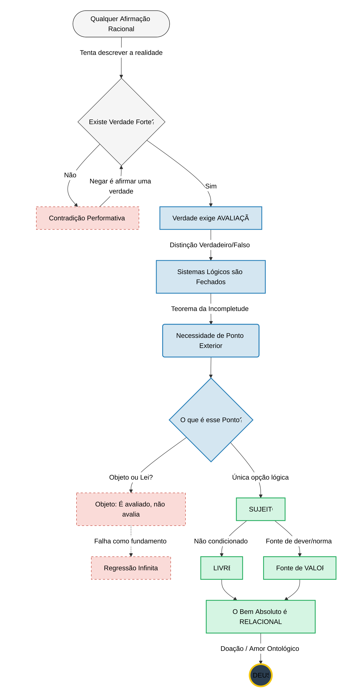

### Enquadramento

Nos anos 1920, o problema central da lógica matemática era o **Entscheidungsproblem** (Hilbert/Ackermann): existiria um procedimento mecânico capaz de determinar, para qualquer fórmula lógica, se ela é validamente derivável — ou seja, verdadeira em todos os modelos?

Em 1936, **Church** e **Turing**, por vias distintas, demonstram que tal algoritmo geral **não pode existir**.

A pergunta “**este programa pára ou não pára?**” cristaliza-se mais tarde como o exemplo mais direto — e devastador — desse limite.

O termo **“halting problem”**, na sua formulação moderna, só se estabiliza posteriormente, sendo geralmente atribuído a **Martin Davis** (1958). Estudos históricos mostram que Turing não usou esse nome, nem lhe atribuiu centralidade especial.

### O problema

A formulação de **Strachey** (1965) assemelha-se a este pseudocódigo:

```python
Q(P):
    if halts(P) == true:
        loop_forever()
    else:
        return
```

Aqui, `Q(P)` entra em loop infinito **se e só se** `P` termina. Assim, se `P` termina ao receber `P` como entrada, `Q(P)` não termina. A contradição emerge quando se tenta aplicar `Q` a si mesmo.

Para simplificar, pensemos assim:

Consideremos um procedimento `P` que, dado um argumento, **retorna sempre** um valor binário: **sim** ou **não**.

Definimos então `Q` como a inversão do resultado de `P` aplicado a si mesmo:

```python
Q(P):
    return not P(P)
```

Ou seja, `Q(P)` devolve o **contrário** de `P(P)`.
Se `P(P)` devolve **sim**, então `Q(P)` devolve **não** — e vice-versa.

Mas o que acontece ao aplicarmos `Q` a si próprio?

Isso nos dá:

**Q(Q) = ¬Q(Q)**

Uma proposição que se afirma igual ao seu próprio oposto — o que é logicamente impossível.

Ou seja, a expressão “q = ¬q” é sempre **falsa**.
(Q(Q)) é uma estrutura que se autonega. Implode. A sua própria regra, quando auto-aplicada, destrói o valor que pretendia estabelecer.

Este padrão formal antecipa o que ocorre **no discurso racional**, quando se nega a existência da verdade forte. É uma estrutura que se desfaz ao tentar aplicar-se a si própria.

Verdade forte = estatuto normativo que distingue acerto real de mera aceitação, independentemente de práticas, consenso ou sucesso instrumental.

Não se trata de verdade como predicado semântico (“corresponde a um modelo”), mas como autoridade racional (“conta como correto”).

### Sobre a auto-contradição performativa

Uma **contradição performativa** ocorre quando alguém **afirma** algo cuja estrutura interna **nega** o próprio ato de afirmar.

Por exemplo: ao dizer “**não existe verdade forte**”, a pessoa está implicitamente a apresentar essa afirmação **como se fosse** verdade forte — negando, na forma, o conteúdo que propõe.

É precisamente esse tipo de impasse que Gödel demonstra:
Em qualquer sistema formal suficientemente expressivo, **a auto-avaliação total falha**.

Um sistema não pode ser simultaneamente:

* completo (produz todas as verdades),
* consistente (não gera contradições),
* e auto-validado (fundar-se a si mesmo sem depender de critério externo).

Logo, **o critério de avaliação do sistema tem de estar fora dele**.

### Sobre a impossibilidade de regressão infinita

Pode-se tentar salvar o sistema com um “avaliador externo”.

Mas se esse avaliador, por sua vez, estiver dentro de outro sistema que o valida, o problema reaparece.

Estamos perante uma **cadeia de sistemas**, cada um tentando fundamentar o anterior. Mas isso não resolve: apenas **adiamos indefinidamente** o problema do fundamento.

Se formos consistentes, temos de assumir:

> Para que haja verdade forte, tem de haver um avaliador **exterior a todo e qualquer sistema**.

Mesmo que se defina um “super-sistema” que inclua todos os outros avaliadores, ele ainda é um sistema — e exige critério exterior.

```
Definição (Sujeito mínimo):
Chama-se Sujeito qualquer instância que:

exerce avaliação normativa;

não deriva essa autoridade de regra externa;

não é objeto de avaliação superior.
```

---

## Objecções sofisticadas — e porque não resolvem o problema

As objecções mais interessantes a este argumento não são superficiais. Pelo contrário: partem de leituras sérias da lógica, da filosofia da linguagem e da epistemologia contemporânea. Ainda assim, nenhuma consegue evitar a conclusão central. Vejamos porquê.

### 1. “A auto-referência só é problemática em sistemas que exigem totalidade”

Esta objecção reconhece o ponto técnico: a contradição surge quando um sistema pretende **decidir todos os casos**, incluindo os que se aplicam a si próprio. A proposta, então, é abdicar dessa exigência de totalidade.

A resposta é simples e decisiva:
ao abdicar da totalidade, abdica-se precisamente daquilo que está em causa.

Um critério de verdade que falha **em princípio** nos casos-limite não é um critério último. Pode ser útil, operativo, até extremamente poderoso — mas não funda a distinção entre verdadeiro e falso *enquanto tal*. Apenas a gere parcialmente.

Esta objecção é coerente, mas concede o ponto central: **não existe verdade forte auto-fundada dentro de um sistema**.

### 2. “A verdade é definida semanticamente, não decidida formalmente”

Aqui invoca-se a distinção clássica entre verdade semântica e decidibilidade sintáctica, muitas vezes com referência a teorias da verdade hierárquicas (à maneira de Tarski).

Mas o problema não é confundirmos verdade com prova. O problema é outro:
**quem valida a adequação da semântica?**

Uma hierarquia de linguagens evita paradoxos locais, mas não elimina a exigência de um critério último que legitime a hierarquia como um todo. A pergunta reaparece inevitavelmente:

> Por que razão esta estrutura semântica — e não outra — é a que corresponde à verdade?

Enquanto essa pergunta fizer sentido, o sistema não se funda a si próprio. A hierarquia organiza o problema; não o resolve.

### 3. “O fundamento pode ser pragmático ou intersubjectivo”

Segundo esta abordagem, a verdade não exige um avaliador último, mas apenas práticas estáveis de justificação, consenso racional ou sucesso pragmático.

Isto funciona bem para explicar **como usamos** o conceito de verdade. Não explica **o que legitima** esse uso.

Práticas podem divergir, consensos podem falhar, êxitos podem ser ilusórios. Chamar “verdade” ao que resulta dessas dinâmicas é possível — mas apenas se já se pressupõe um critério pelo qual práticas, consensos e êxitos são avaliados como adequados ou inadequados.

Sem esse critério, o termo “verdade” perde força normativa e torna-se descritivo. O argumento não é derrotado; é contornado ao preço de redefinir o conceito.

### 4. “A regressão infinita é aceitável; não precisamos de um ponto final”

Alguns filósofos aceitam regressões infinitas como estruturalmente legítimas. Não há contradição formal em tal regressão.

O problema aqui não é formal, mas fundacional.

Uma cadeia infinita de justificações explica **como algo é sempre justificado por outra coisa**, mas nunca explica **por que razão o conjunto inteiro tem autoridade justificativa**.

Se nenhuma instância da cadeia possui estatuto fundante, então nenhuma a transmite. A regressão pode ser logicamente consistente, mas permanece epistemicamente vazia.

Aceitá-la equivale a aceitar que não há fundamento — o que volta a negar a verdade forte.

### 5. “O avaliador último pode ser uma estrutura impessoal necessária”

Esta é talvez a objecção mais forte. Concede a necessidade de algo extra-sistémico, mas recusa chamá-lo “Sujeito”.

O problema é que uma estrutura impessoal necessária continua a funcionar segundo propriedades fixas. Se essas propriedades são suficientes para fundamentar a verdade, então podem, em princípio, ser formalizadas — e voltamos ao problema da auto-avaliação.

Se não podem ser formalizadas, então já não estamos a falar de uma estrutura no sentido forte, mas de algo que **exerce avaliação sem ser redutível a regras**.

Um fundamento normativo impessoal só difere de um avaliador se operar inteiramente segundo propriedades fixas.

Se assim for, ele é, em princípio, formalizável — e reincide no problema da auto-avaliação.

Se não for formalizável, então exerce discriminação normativa sem regra externa. Nesse ponto, a recusa do termo avaliador não descreve uma diferença ontológica, mas apenas uma preferência terminológica.

Sobre a impossibilidade de normatividade impessoal última

Um critério normativo último não apenas classifica ocorrências; ele estabelece autoridade. Distinguir o correto do incorreto não é um acto meramente descritivo, mas um acto de validação.

Qualquer instância que desempenhe essa função deve satisfazer simultaneamente duas condições:

Capacidade de discriminação não derivada — o critério não pode ser aplicado em virtude de uma regra superior, sob pena de regressão;

Autoridade não transmissiva — o estatuto normativo não pode ser herdado de outro fundamento.

Uma “estrutura impessoal” opera exclusivamente segundo propriedades fixas. Mas propriedades fixas só exercem normatividade se forem interpretadas como normativas — e essa interpretação já pressupõe um acto avaliativo anterior.

Assim, uma estrutura impessoal pode veicular normatividade, mas não fundá-la. Fundar normatividade exige um acto originário de validação que não decorre de propriedades, regras ou leis — mas que as institui.

Nesse sentido rigoroso, o fundamento normativo último não é apenas extra-sistémico, mas agente: não porque possua psicologia, mas porque exerce autoridade sem derivação. Chamar-lhe “Sujeito” não acrescenta conteúdo teológico; apenas nomeia a função ontológica mínima que ele já desempenha.

### 6. “Nada disto exige pessoalidade ou relacionalidade”

Correcto: não *exige* no sentido dedutivo estrito.

Mas o argumento não pretende deduzir todas as propriedades do fundamento. Pretende mostrar que:

* o fundamento não é objeto,
* não é sistema,
* não é produto de regras,
* e não é condicionado por nada externo.

“Até este ponto, a conclusão é estritamente negativa: o fundamento último da verdade não é sistema, não é objeto e não é redutível a regras formais.

A designação desse fundamento como Sujeito não é uma dedução lógica adicional, mas a identificação ontológica mínima compatível com o papel já demonstrado: avaliar sem ser avaliado, fundar sem ser fundado, agir sem regra externa.”

### 7. Objecção adicional: “A normatividade é um facto bruto”

Resposta:
Um facto bruto pode descrever regularidades, mas não instituir autoridade.

Um “facto” só é normativo se contar como razão.
Contar como razão não é uma propriedade descritiva — é um estatuto conferido.

Se a normatividade fosse um facto bruto:

ou seria normativamente vinculativa → exige critério de validade;

ou não vinculativa → deixa de ser normatividade.

Logo, “facto normativo bruto” é uma contradição categorial: ou é bruto e não normativo, ou normativo e não bruto.

## Conclusão desta secção

As objecções mais sofisticadas não falham por erro técnico, mas por concessão estrutural. Cada uma tenta preservar a racionalidade local sacrificando algo essencial: totalidade, normatividade, ou fundamento. O que nenhuma consegue fazer é manter, ao mesmo tempo, a prática racional da afirmação e a negação da verdade forte.

Isso é decisivo.

Não é coerente dizer simplesmente que “a verdade não é fundamentável” — porque essa própria afirmação se apresenta como verdadeira em sentido forte. Não é proposta como uma convenção local, um sucesso pragmático ou uma regra provisória, mas como uma descrição correta da realidade racional.

Recorremos ao princípio da Normatividade Forte:
Toda afirmação racional que se apresenta como válida para além de um contexto local pressupõe um critério de verdade que não depende apenas de práticas, consenso ou sucesso pragmático.

Negar este princípio não gera contradição formal, mas implica abdicar da pretensão de validade racional forte - inclusive para a própria negação.

Assim, o dilema inicial revela-se assimétrico:

Qualquer afirmação que pretenda validade transcontextual — isto é, que se apresente como correta independentemente de práticas locais — já pressupõe uma distinção normativa entre acerto e erro que não pode ser reduzida a consenso, utilidade ou estabilidade prática sem perda semântica. Negar essa normatividade não gera contradição formal, mas dissolve a própria pretensão de correção que o discurso continua a exercer.

Logo, a verdade forte não é opcional; é condição de possibilidade de qualquer afirmação significativa — incluindo as críticas a este argumento.

Uma vez reconhecida a necessidade da verdade forte, o resto segue-se com rigor:

O resultado de Gödel e dos esquemas de diagonalização não mostra apenas um limite epistémico (o que pode ser provado), mas um limite estrutural: o critério último de correção não pode ser totalmente especificado por meios internos ao sistema que ele avalia. Trata-se, portanto, de uma dependência semântica e normativa, não meramente metodológica.

nenhuma regressão infinita fornece fundamento;

Um critério de verdade não é apenas uma condição de ocorrência, mas uma instância de discriminação normativa: ele distingue o que conta como correto do que não conta. Qualquer entidade que desempenhe esse papel não pode ser puramente descritiva; ela exerce função avaliativa.

Chamar a esse fundamento “Avaliador”, “Fundamento”, ou “Sujeito” não é uma escolha retórica, mas ontológica: trata-se de algo que avalia sem ser avaliado, que funda sem ser fundado, e que não opera segundo regras que lhe sejam externas.

O argumento não força uma teologia.
Mas impede, de forma limpa, a recusa do fundamento.

A partir deste ponto, a discordância já não incide sobre a validade interna das inferências, mas sobre a disposição de aceitar ou recusar os compromissos ontológicos exigidos pela normatividade racional forte.
Depois disso, discordar já não é questão de lógica — é uma decisão metafísica consciente.

# Princípio de suficiência ontológica mínima

Sempre que uma função explanatória é demonstrada como necessária, a ontologia mínima adequada é aquela que:

(i) é suficiente para desempenhar essa função,

(ii) não introduz entidades ou propriedades redundantes,

(iii) não reintroduz, sob outra forma, o problema que pretende resolver.

No presente caso, a função necessária é clara: fundar a distinção normativa entre verdadeiro e falso sem recorrer a critérios externos ou regras prévias.

Postular um fundamento que:

seja objeto,

seja estrutura impessoal,

ou seja conjunto de propriedades necessárias,

falha o critério (iii), pois cada uma dessas opções ou exige validação externa ou reincide na formalização que o argumento já excluiu.

A identificação do fundamento como Sujeito não acrescenta propriedades supérfluas; pelo contrário, remove todas as que se revelaram insuficientes. Trata-se, portanto, não de um enriquecimento metafísico, mas de uma redução ontológica orientada pela função.

À luz deste princípio, resta agora identificar que tipo de entidade satisfaz minimamente essas condições sem reintroduzir os problemas já excluídos.

### Sujeito no sentido forte

Esse Avaliador é **necessário**, como demonstrado.
Não é condicionado por nada externo e, nesse sentido rigoroso, é livre.

É **Sujeito** no sentido forte.

Na lógica formal:

* um **objeto** de avaliação é algo inscrito num sistema;
* um **avaliador** é o que está fora, e estabelece o critério de verdade.

Ao usarmos a palavra *Sujeito*, não falamos de consciência psicológica nem de alguma propriedade emergente de sistemas complexos.

(Essa tese, aliás, seria equivalente a tentar somar números negativos e esperar obter um número positivo por mágica.)

Falamos de Alguém que **realmente merece** o nome de Sujeito:
livre, incondicionado, e **exterior a todos os sistemas**.

### Bom, Pessoal e Relacional

Se o fundamento da verdade é também o fundamento da normatividade, então ele não pode ser axiologicamente neutro. A neutralidade já seria uma posição normativa. Nesse sentido preciso — e apenas nesse — o fundamento é identificável com o Bem.

Tudo o que existe fora de Si é **doação**: expressão livre de um Ser necessário.
E se existirem outros sujeitos (como é razoável supor, embora não se prove aqui), então Ele partilha a sua essência com eles — sendo, por isso, também **pessoal** e **relacional**.

Ou seja, a estrutura da Verdade e do Valor conduz, de forma natural, às características tradicionalmente atribuídas a Deus — **sem saltos retóricos, sem apelos emocionais, sem hipóteses ad hoc**.

# Diagrama lógico



# Atributos clássicos.
Esta prova não se apresenta negável sem abdicação explícita da normatividade racional forte.

**Não é um salto teológico**, nem uma redefinição oportunista de “Deus”. É o **fecho necessário** do que já foi estabelecido. Cada atributo clássico surge **por necessidade lógica**, não por tradição.

## 1. Existência necessária

Já foi demonstrado que:

* a verdade forte é inescapável;
* a verdade forte exige avaliação;
* nenhum sistema pode avaliar-se totalmente;
* logo, existe um **fundamento extra-sistémico da verdade**.

Esse fundamento **não pode não existir** sem destruir a própria possibilidade de afirmação verdadeira.

Logo, não é contingente.

**Logo,** existe necessariamente uma instância que satisfaz exatamente os atributos tradicionalmente designados por ‘Deus’.
Negar a sua existência é negar a condição de possibilidade da própria negação.

## 2. Unicidade

Suponhamos dois fundamentos últimos distintos.

Para serem distintos, teria de haver:

* um critério que os distinguisse, ou
* uma limitação que um não partilha com o outro.

Mas qualquer critério ou limitação exigiria:

* um fundamento superior que os avaliasse.

Contradição.

**Conclusão:** o fundamento último é **único**.

## 3. Simplicidade (não-composto)

Tudo o que é composto:

* depende das suas partes,
* e da regra que as une.

O fundamento último:

* não pode depender de nada,
* nem ser explicado por estrutura interna.

Logo, não é composto, não tem partes, não é agregável.

**Conclusão:** Deus é **simples** (no sentido clássico, não material).

## 4. Aseidade (existência por Si)

Se o fundamento recebesse o ser de outro:

* esse outro seria o verdadeiro fundamento.

Impossível.

**Conclusão:** Deus existe **por Si**, não por causa externa.

## 5. Imutabilidade

Mudança implica:

* passar de potência a acto,
* adquirir o que antes faltava.

Mas o fundamento último:

* não carece de nada,
* não pode tornar-se mais do que é.

**Conclusão:** Deus é **imutável**.

## 6. Eternidade (fora do tempo)

O tempo mede mudança.

Sendo imutável, o fundamento:

* não está no tempo,
* não sofre antes/depois.

**Conclusão:** Deus é **eterno**, não temporalmente infinito, mas **fora do tempo**.

## 7. Onipotência (no sentido rigoroso)

Poder significa:

* capacidade de realizar o possível.

O fundamento:

* não é limitado por nada externo,
* é a condição de possibilidade de toda a realidade.

Não pode fazer o logicamente contraditório — isso não é poder, é nonsense.

**Conclusão:** Deus é **omnipotente** no sentido clássico e coerente.

## 8. Onisciência

A verdade de qualquer coisa depende, em última instância, do fundamento da verdade.

Logo:

* nada verdadeiro pode ser exterior ao seu conhecimento,
* nada real pode escapar ao seu alcance cognitivo.

**Conclusão:** Deus é **onisciente**.

## 9. Bondade absoluta

O mal é sempre:

* privação,
* desordem,
* falta de ser.

O fundamento do ser:

* não carece,
* não falha,
* não é deficiente.

Além disso, tudo o que existe fora de Si é **doação**, não necessidade.

**Conclusão:** Deus é **o Bem absoluto**.

## 10. Intelecto e vontade (pessoalidade)

O fundamento:

* avalia (intelecto),
* funda normatividade (vontade),
* não opera por regra externa.

Isso é exactamente o que define **agir pessoal**, não mecânico.

Não se trata de psicologia.
Trata-se de **acto livre com conhecimento**.

**Conclusão:** Deus é **pessoal**.

## 11. Relacionalidade

Se existirem outros sujeitos finitos:

* o seu ser deriva do fundamento,
* a relação não é necessária, mas livre.

Logo, a criação é **acto relacional**, não efeito mecânico.

**Conclusão:** Deus é **relacional por liberdade**, não por carência.

## 12. Inegabilidade

Negar este Deus implica uma das seguintes opções:

1. Negar verdade forte
   → contradição performativa.

2. Aceitar verdade sem fundamento
   → colapso normativo.

3. Aceitar fundamento impessoal formalizável
   → regressão ao problema da auto-avaliação.

4. Aceitar regressão infinita
   → ausência total de fundamento.

Nenhuma preserva discurso racional pleno.

## Conclusão final

O Deus aqui demonstrado não é:

* uma hipótese,
* uma explicação concorrente,
* um “Deus das lacunas”.

É **condição de possibilidade** da verdade, do valor e da racionalidade.

Por isso:

> Deus, com os atributos clássicos de necessidade, unicidade, simplicidade, eternidade, omnipotência, onisciência, bondade e pessoalidade, **não é apenas demonstrável** — é **extremamente convincente**.

De qualquer forma, o que se mostra aqui não é que a negação de Deus seja logicamente impossível, mas que ela não pode ser mantida sem custo: exige a renúncia explícita à verdade forte e à normatividade racional plena.

Nesse sentido preciso — e apenas nesse — o fundamento último não é refutável a partir de dentro do discurso racional que continua a operar com pretensões de verdade.

A partir deste ponto, a discordância já não incide sobre inferências lógicas, mas sobre a disposição de assumir ou não os compromissos ontológicos exigidos pela normatividade racional forte.

# Forma lógica do argumento

```
Se:
existe verdade forte;
verdade forte exige critério último;
nenhum sistema formal pode fornecer tal critério;

então:
existe um fundamento extra-sistémico da verdade.

Se, adicionalmente:
4. esse fundamento não opera por regras externas;

então:
Resta, então, um tipo de instância que exerce avaliação sem ser regida por critérios externos — isto é, uma fonte originária de normatividade.

Na tradição filosófica, tal instância é denominada Sujeito, não no sentido psicológico, mas no sentido ontológico: aquilo que age e avalia sem ser previamente determinado.
```

# Pensamentos para fechar

1. Se algo é **Lei**, é formalizável -> Cai em Gödel.

2. Se for **Mecânico**, é um sistema -> Exisge avaliador externo.

3. Se é a **Origem da Norma**, deve ser um **Ato**.

Na filosofia da linguagem, isso nos remete ao conceito de ilocução: a verdade não é apenas um estado de coisas, é um "crer" ou um "dizer" que algo é o caso. Se o fundamento da verdade opera essa distinção sem ser compelido por uma regra anterior, ele está exercendo **Liberdade**.

Não é à toa que se usa a palavra **Verbo** para O descrever.
