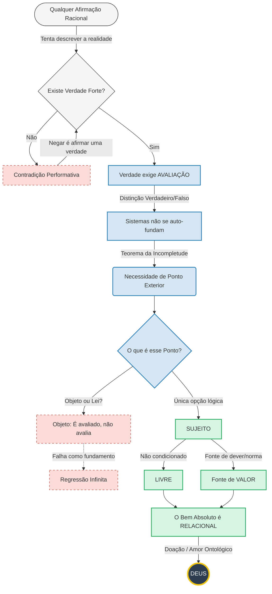

# Aquilo que Avalia sem Ser Avaliado

## Enquadramento

Nos anos 1920, um dos problemas centrais da lógica matemática era o **Entscheidungsproblem** (Hilbert/Ackermann): existiria um procedimento mecânico capaz de determinar, para qualquer fórmula lógica, se ela é validamente derivável — isto é, verdadeira em todos os modelos?

Em 1936, **Church** e **Turing**, por vias distintas, mostraram que tal algoritmo geral **não pode existir**. Isso muda tudo.

A pergunta **“este programa pára ou não pára?”** cristaliza-se mais tarde como a formulação paradigmática desse limite, conhecido posteriormente como *halting problem*.

### O problema
Consideremos um procedimento `P` que devolve um valor binário. Definimos `Q` como a inversão do resultado de `P` aplicado a si mesmo:
```python
def Q(P):
    # Inverte o resultado de P aplicado a si mesmo, ilustrando o paradoxo de auto-referência
    return not P(P)
```

O que acontece ao aplicarmos `Q` a si próprio?

Ao aplicar `Q` a si próprio, obtemos imediatamente:

**Q(Q) = ¬Q(Q)**

> **Nota técnica**: Não se trata de um programa executável nem de uma definição computacional literal, mas de um **esquema de diagonalização**. A expressão `Q(Q) = ¬Q(Q)` representa a fixação semântica do ponto diagonal onde uma função supostamente decisora é aplicada ao seu próprio índice. Não descreve um processo computável, mas explicita a impossibilidade estrutural de auto-decisão total.

Uma equação que se desfaz em contradição lógica pura.

O paradoxo não é o ponto central; é apenas o sintoma. O que ele expõe é um limite estrutural profundo: **nenhum sistema pode estabelecer, a partir de si mesmo, o critério normativo que o julga**.

Esse mesmo padrão ressurge sempre que o discurso racional tenta negar a existência de **verdade forte**.

## Sobre a auto-contradição performativa

Há contradição performativa quando o conteúdo de uma afirmação nega o próprio acto de afirmar.

Exemplo: Dizer “não existe verdade forte” apresenta essa afirmação como verdadeira em sentido forte, sob pena de perder qualquer razão para a considerar válida.

Trata-se do mesmo impasse estrutural identificado por Gödel: a auto-avaliação total falha.

Gödel não é aqui invocado como teorema técnico estrito, mas como instância paradigmática de um limite estrutural: a impossibilidade de auto-fundação normativa total.

> **Nota semântica (Tarski)**
> O limite aqui explorado não é apenas o da prova formal ou da decidibilidade (Gödel/Church/Turing), mas o da própria **definição de verdade**. Como mostrou **Alfred Tarski**, a noção de verdade de uma linguagem não é definível nessa mesma linguagem: exige sempre um **meta-nível semântico exterior**. Este resultado fixa, em termos semânticos, o mesmo padrão estrutural: a verdade não se funda a partir de dentro do sistema que a exprime.

Conclusão: o critério último de avaliação tem de residir **fora** do sistema.

> Um conceito meramente deflacionário de verdade é suficiente para descrever usos linguísticos locais, mas é **insuficiente para explicar erro racional, desacordo genuíno ou crítica transcontextual**. Sempre que se distingue entre uso correcto e incorrecto — e não apenas entre uso aceite e rejeitado — já se pressupõe normatividade não-redutível. É esse excedente normativo que aqui se designa por verdade forte.

## Sobre a impossibilidade de regressão infinita

Pode tentar-se salvar o esquema com um “avaliador externo”.

Mas, se esse avaliador estiver integrado noutro sistema que o valida, o problema reaparece. Forma-se uma cadeia de sistemas que se justificam mutuamente, sem produzir fundamento: apenas **adiamento indefinido**.

Se formos consequentes, segue-se:

## Definição (Sujeito mínimo)
Designamos por **Sujeito** a instância mínima que satisfaz simultaneamente quatro condições irredutíveis:

1. Exercer **avaliação normativa** (discriminar o correcto do incorrecto);
2. Não derivar a sua autoridade de qualquer regra ou critério externo;
3. Não estar sujeito a qualquer avaliação superior;
4. Não se reduzir a propriedades, estruturas, leis ou funções formais.

Qualquer instância que satisfaça estas quatro condições exerce, funcionalmente, aquilo que na tradição ontológica se denomina **Sujeito**. Recusar o termo mantendo a função é mera substituição lexical sem ganho explanatório.

Estas condições não descrevem uma entidade empírica, mas uma função ontológica mínima exigida pela normatividade racional.

> **Nota Terminológica (sobre “Sujeito”)**
> O termo "Sujeito" é aqui usado em sentido estritamente ontológico, não psicológico nem fenomenológico. Remete à tradição clássica do *ὑποκείμενον* (hypokeímenon: termo grego antigo que significa 'aquilo que subjaz', como base que sustenta determinações, sem conotações de 'eu' consciente moderno). Nesta acepção original — anterior à reinterpretação cartesiana — o Sujeito não é consciência representacional, mas condição de possibilidade da determinação normativa. A oposição entre *subjectum* e *objectum* é assimétrica: o objecto é posto; o Sujeito sustenta a relação. É nesse sentido arcaico que usamos o termo.

## Nota fundamental: verdade material e normatividade

O argumento não diz apenas respeito à validade discursiva ou à coerência interna de sistemas racionais. O que está em causa é a possibilidade de **verdade material** — isto é, de afirmações serem verdadeiras ou falsas **em virtude de como a realidade é**, e não apenas em virtude de uso, aceitação ou sucesso prático.

A verdade material exige mais do que regularidade causal ou eficácia instrumental. Exige a possibilidade de **erro real**: a possibilidade de que uma afirmação falhe *mesmo que seja aceite*, *mesmo que funcione*, *mesmo que esteja estabilizada numa prática*. Sem essa possibilidade, “verdade” colapsa em utilidade ou consenso.

Ora, a distinção entre acerto material e erro material **é normativa**: implica um critério pelo qual *corresponder ao real* conta como correcto, e *não corresponder* conta como incorrecto. Essa distinção não pode ser fornecida por factos brutos, causalidade, emergência ou práticas, pois todas essas descrições já pressupõem a diferença entre descrever correctamente e descrever incorrectamente.

Assim, a verdade material **pressupõe normatividade forte**. Negar normatividade forte não conduz a uma versão alternativa de verdade material; conduz à sua dissolução.

É este ponto que fixa o alcance ontológico do argumento: não se trata apenas de justificar discursos, mas de tornar inteligível a própria ideia de que o mundo pode tornar uma afirmação verdadeira ou falsa.

## Objecções sofisticadas — e por que não resolvem

As melhores objecções não são superficiais: assentam em lógica, filosofia da linguagem e epistemologia contemporânea. Ainda assim, nenhuma evita a conclusão central.

### 1) “A auto-referência só é problemática quando se exige totalidade”

Segundo esta objecção, a contradição surge quando o sistema pretende decidir **todos** os casos, incluindo os auto-aplicáveis. Propõe-se, então, renunciar à totalidade.

Mas ao renunciar à totalidade renuncia-se ao que está em causa: um critério último.

Um critério que falha **em princípio** nos casos-limite pode ser útil e poderoso, mas não funda a distinção entre verdadeiro e falso **enquanto tal**; administra-a apenas parcialmente.

Esta objecção é coerente, mas concede o ponto: **não há verdade forte auto-fundada dentro de um sistema**.

### 2) “A verdade é semântica, não decidibilidade formal”

Invoca-se a distinção entre verdade semântica e decidibilidade sintáctica (por exemplo, em moldes tarskianos). Mas o problema não é confundir “verdade” com “prova”.

A pergunta é: **quem legitima a semântica?**

Hierarquias de linguagem evitam paradoxos locais, mas não eliminam a exigência de um critério último que valide a hierarquia como um todo:

> Por que razão esta estrutura semântica — e não outra — corresponde à verdade?

Enquanto esta pergunta fizer sentido, o sistema não se funda a si próprio. A hierarquia organiza o problema; não o encerra.

### 3) “O fundamento pode ser pragmático ou intersubjectivo”

Práticas estáveis, consenso racional ou sucesso pragmático explicam bem **como usamos** “verdade”. Não explicam **o que legitima** esse uso.

Práticas divergem, consensos falham, êxitos iludem. Chamar “verdade” ao que resulta dessas dinâmicas é possível — mas só se já se pressupõe um critério pelo qual essas dinâmicas contam como adequadas ou inadequadas.

Sem esse critério, “verdade” perde força normativa e torna-se descritivo. Essa objecção evita o argumento apenas ao custo de alterar o próprio conceito de verdade.

### 4) “A regressão infinita é aceitável; não precisamos de ponto final”

O problema aqui é fundacional: uma cadeia infinita diz apenas que cada justificação remete para outra, mas nunca explica por que razão o conjunto tem autoridade justificativa.

### 5) “O avaliador último pode ser uma estrutura impessoal necessária”

Concede-se a exterioridade ao sistema, mas recusa-se o termo “Sujeito”.

Se essa estrutura opera por propriedades fixas suficientes para fundamentar a verdade, então é formalizável — e regressa-se ao problema da auto-avaliação.

Se não é formalizável, então exerce discriminação normativa sem regra externa. Nesse ponto, a recusa de “avaliador” é terminológica, não ontológica.

**Sobre a impossibilidade de normatividade última impessoal:** Uma estrutura impessoal pode transportar normatividade, mas não a pode fundar.

### 6) “Nada disto exige pessoalidade ou relacionalidade”

Não exige no sentido dedutivo estrito.

Até aqui a conclusão é negativa. “Sujeito” surge como identificação ontológica mínima compatível com o papel demonstrado: avaliar sem ser avaliado, fundar sem ser fundado.

### 7) “A normatividade é um facto bruto”

Um facto bruto pode descrever regularidades; não institui autoridade.

Um “facto” só é normativo se **contar como razão**. “Contar como razão” não é descritivo; é estatuto conferido.

Se a normatividade fosse facto bruto:

* ou vinculava (exigindo critério de validade),
* ou não vinculava (deixando de ser normatividade).

Portanto, “facto normativo bruto” é uma confusão categorial: ou é bruto e não normativo, ou normativo e não bruto.

> **Nota sobre o quietismo**
> O quietismo não resolve o problema; limita-se a **suspender a pergunta**. Essa suspensão é existencialmente legítima, mas é incompatível com qualquer discurso que ainda pretenda validade racional, crítica filosófica ou justificação teórica. O argumento aplica-se apenas a quem permanece no jogo da razão normativa — e é precisamente aí que o quietismo deixa de oferecer resposta.

### Conclusão desta secção

As objecções mais fortes falham por concessão estrutural: salvam racionalidade local ao custo de totalidade, normatividade ou fundamento. Nenhuma preserva simultaneamente a afirmação racional forte e a negação da verdade forte — afirmar que “a verdade não é fundamentável” (com pretensão transcontextual) já a trata como verdadeira em sentido forte, ou abdica-se imediatamente da validade.

**Princípio de Normatividade Forte:** toda afirmação racional que se apresenta como válida para além de um contexto local pressupõe um critério de verdade que não se reduz a práticas, consensos ou êxitos pragmáticos.

Negar esse princípio não gera uma contradição formal, mas dissolve a própria pretensão de validade racional forte, inclusive para a própria negação.

Assim, o dilema é assimétrico: qualquer afirmação com pretensão transcontextual já pressupõe a distinção normativa entre acerto e erro que não pode ser reduzida a consenso, utilidade ou estabilidade sem perda de sentido.

Gödel e os esquemas de diagonalização revelam um limite estrutural: o critério último de correcção não pode ser especificado internamente ao sistema avaliado — trata-se de dependência normativa e semântica, não apenas metodológica. Nenhuma regressão infinita fornece fundamento real, pois o critério de verdade exige discriminação normativa não-descritiva. Chamar-lhe “Sujeito” não é retórica: é a nomeação mínima da função de avaliar sem ser avaliado.

## Princípio de suficiência ontológica mínima

Sempre que uma função explanatória é demonstrada como necessária, a ontologia mínima adequada é aquela que:

(i) é suficiente para desempenhar essa função,

(ii) não introduz entidades ou propriedades redundantes,

(iii) não reintroduz, sob outra forma, o problema que pretende resolver.

No presente caso, a função necessária é clara: fundar a distinção normativa entre verdadeiro e falso sem recorrer a critérios externos ou regras prévias.

Postular um fundamento que:
1. seja um **objeto**,
2. seja uma **estrutura impessoal**,
3. ou seja um **conjunto de propriedades necessárias**,

viola o critério (iii), pois cada uma dessas opções exige validação externa ou reincide na formalização já descartada.

A identificação do fundamento como Sujeito não acrescenta propriedades supérfluas; pelo contrário, remove todas as que se revelaram insuficientes. Trata-se, portanto, não de um enriquecimento metafísico, mas de uma redução ontológica orientada pela função.

À luz deste princípio, resta agora identificar que tipo de entidade satisfaz minimamente essas condições sem reintroduzir os problemas já excluídos.

### Sujeito no sentido forte

Esse Avaliador é **necessário**, como demonstrado.
Não é condicionado por nada externo e, nesse sentido rigoroso, é livre.

É **Sujeito** no sentido forte.

Na lógica formal:

* um **objeto** de avaliação é algo inscrito num sistema;
* um **avaliador** é o que está fora, e estabelece o critério de verdade.

Ao usarmos a palavra *Sujeito*, não falamos de consciência psicológica nem de alguma propriedade emergente de sistemas complexos.

(Tal tese equivaleria a somar números negativos e esperar obter um número positivo por mera magia — uma impossibilidade categorial.)

> **Nota ontológica (autoridade)**
> Avaliar normativamente não é apenas discriminar entre estados possíveis; é **atribuir autoridade** à distinção entre correcto e incorrecto. Autoridade não é um facto bruto nem uma estrutura impessoal: não descreve, **vincula**. Tudo o que vincula sem regra externa exerce autoridade em sentido próprio — e autoridade é sempre exercida por alguém, ainda que não psicológico, temporal ou empírico. Uma instância verdadeiramente última não pode ser impessoal sem regressar à formalização já excluída.

Falamos de Alguém que **realmente merece** o nome de Sujeito:
livre, incondicionado e **exterior a todos os sistemas**.

### Bom, Pessoal e Relacional
Se o fundamento da verdade é também o da normatividade, então não pode ser axiologicamente neutro — neutralidade já seria uma posição normativa imposta. Assim, identifica-se com o Bem: não como um valor entre outros, mas como condição de possibilidade de toda valoração (consequência direta da função fundacional, sem adições externas).

A partir deste ponto, o argumento desenvolve consequências ontológicas. Se existirem sujeitos finitos (hipótese plausível, não demonstrada aqui), a relação com o fundamento não pode ser necessária nem mecânica — seria mera extensão estrutural ou efeito causal. Em vez disso, é livre, por plenitude ontológica, não dependência.

É nesse sentido que o fundamento é pessoal e relacional: exerce autoridade normativa e estabelece relação sem determinação externa.

## Atributos clássicos
Os atributos aqui derivados não constituem propriedades acrescentadas ao fundamento, mas **negações formais de modos de dependência** incompatíveis com a função fundacional já demonstrada. Cada atributo resulta da exclusão de alternativas que reintroduziriam composição, limitação ou dependência externa.

Esta demonstração não pode ser negada sem que se abdique explicitamente da normatividade racional forte.

Não estamos aqui a fazer teologia, mas a extrair consequências ontológicas rigorosas. Segue-se o **desdobramento lógico inevitável** das propriedades que qualquer fundamento último da verdade e da normatividade tem necessariamente de possuir — independentemente de herança doutrinal ou tradição conceptual.

### 1. Existência necessária
Já foi demonstrado que a verdade forte é inescapável, exige avaliação e nenhum sistema pode avaliar-se totalmente. Logo, existe um fundamento extra-sistémico da verdade — que não pode não existir sem destruir a possibilidade de afirmação verdadeira. É, portanto, necessário.

'Deus' é aqui um termo de identificação ontológica, não uma premissa teológica.

**Conclusão:** Existe necessariamente uma instância que satisfaz os atributos tradicionalmente designados por ‘Deus’.

### 2. Unicidade
Suponhamos dois fundamentos últimos distintos. Para serem distintos, haveria necessidade de um critério ou limitação — o que exigiria um fundamento superior que os avaliasse. Contradição.

**Conclusão:** O fundamento último é **único**.

### 3. Simplicidade (não-composto)
Tudo o que é composto depende das suas partes e da regra que as une. O fundamento último não pode depender de nada nem ser explicado por estrutura interna.

**Conclusão:** Deus é **simples** (no sentido clássico, não material).

### 4. Aseidade (existência por Si)
Se o fundamento recebesse o ser de outro, esse outro seria o verdadeiro fundamento. Impossível.

**Conclusão:** Deus existe **por Si**, não por causa externa.

### 5. Imutabilidade
Mudança implica passar de potência a acto, adquirir o que faltava. O fundamento último não carece de nada nem pode tornar-se mais do que é.

**Conclusão:** Deus é **imutável**.

### 6. Eternidade (fora do tempo)
O tempo mede mudança; sendo imutável, o fundamento não está no tempo nem sofre antes/depois.

**Conclusão:** Deus é **eterno** (fora do tempo, não temporalmente infinito).

### 7. Onipotência (no sentido rigoroso)
O fundamento não é limitado por nada externo e é a condição de possibilidade de toda a realidade. Não pode fazer o logicamente contraditório — isso não é poder, mas absurdo.

**Conclusão:** Deus é **omnipotente** no sentido clássico e coerente.

### 8. Onisciência
A verdade de qualquer coisa depende, em última instância, do fundamento da verdade. Nada verdadeiro ou real pode escapar ao seu conhecimento.

**Conclusão:** Deus é **omnisciente**.

### 9. Bondade absoluta
O mal é privação, desordem ou falta de ser. O fundamento do ser não carece, não falha nem é deficiente; tudo o que existe fora de Si é dádiva, não necessidade.

**Conclusão:** Deus é **o Bem absoluto**.

### 10. Intelecto e vontade (pessoalidade)
O fundamento avalia (intelecto), funda normatividade (vontade) e não opera por regra externa — define exactamente o acto livre com conhecimento.

**Conclusão:** Deus é **pessoal** (não mera psicologia).

### 11. Relacionalidade
Se existirem sujeitos finitos, o seu ser deriva do fundamento e a relação não é necessária, mas livre — a criação é acto relacional, não efeito mecânico.

**Conclusão:** Deus relaciona-se **por liberdade**, não por carência.

### 12. Inegabilidade
Negar este Deus implica: negar verdade forte (contradição performativa), aceitar verdade sem fundamento (colapso normativo), fundamento impessoal formalizável (regressão à auto-avaliação) ou regressão infinita (ausência de fundamento). Nenhuma opção preserva discurso racional pleno.

**Conclusão:** A negação não é sustentável sem abdicação da racionalidade forte.

> A negação deste fundamento é psicologicamente possível e logicamente formulável, mas perde estatuto racional vinculativo. Quem a adopta abdica, nesse mesmo acto, da pretensão de que a sua posição deva ser aceite como correcta — inclusive por si próprio enquanto agente racional.

### Conclusão final
O Deus aqui demonstrado não é um "Deus das lacunas", mas a condição de possibilidade da verdade, valor e racionalidade. Assim, com atributos clássicos como necessidade, unicidade, simplicidade, eternidade, omnipotência, onisciência, bondade e pessoalidade, não é apenas demonstrável — é **racionalmente vinculativo** para quem valoriza a normatividade plena.

Negar implica custos, como renúncia à verdade forte, mas não é logicamente impossível. Diante disto, que implicações tem esta visão para a nossa compreensão da racionalidade quotidiana? Convido o leitor a refletir.

## Forma lógica do argumento

```
Se:
existe verdade forte;
verdade forte exige critério último;
nenhum sistema formal pode fornecer tal critério;

então:
existe um fundamento extra-sistémico da verdade.

Se, adicionalmente:
4. esse fundamento não opera por regras externas;

então:
Resta, então, um tipo de instância que exerce avaliação sem ser regida por critérios externos — isto é, uma fonte originária de normatividade.

Na tradição filosófica, tal instância é denominada Sujeito, não no sentido psicológico, mas no sentido ontológico: a instância que age e avalia sem ser determinada por outra.
```

## Diagrama lógico


# Vídeo explicativo
[Aqui disponível](https://tty.pt/maquina.mp4)

## Objecções adicionais — e por que também não resolvem

As objecções aqui apresentadas surgem de uma análise posterior ao argumento principal, mas seguem padrões semelhantes aos já tratados. Elas não introduzem falhas novas; em vez disso, reforçam a estrutura do dilema ao tentarem alternativas que, no final, ou concedem o ponto central ou reincidem nos problemas de auto-avaliação e regressão. Cada uma é examinada com rigor, mostrando que não escapam à necessidade de um fundamento extra-sistémico pessoal e normativo.

### 1) “A realidade não é um sistema formal?”

Esta objecção sugere que os limites de Gödel e Turing se aplicam apenas a sistemas formais estritos, e que o universo — sendo “desordenado”, emergente ou não-axiomatizável — não precisa de um avaliador externo. Invoca-se naturalismo (e.g., Dennett) ou mecânica quântica como exemplos de mecanismos que fornecem fundações “suficientemente boas” sem sujeito transcendente.

Mas esta distinção falha por confundir escopo: o argumento não assume que a realidade *é* um sistema formal como aritmética de Peano; usa esses limites como paradigma para *qualquer* estrutura auto-contida que pretenda fundar a própria normatividade. Leis físicas, processos evolutivos ou indeterminismo quântico são descritivos — explicam *como* as coisas ocorrem, não *por que* contam como normativamente verdadeiras. Sem um critério externo, reduzem-se a factos brutos ou emergência, que já foram descartados como incapazes de instituir autoridade normativa (ver Objecção 7 anterior). Esta contra-argumentação colapsa a normatividade em descrição, sacrificando a verdade forte — precisamente o custo assimétrico que o argumento destaca.

### 2) “A contradição performativa não é decisiva?”

Aqui, invoca-se deflacionismo (e.g., Horwich) ou quietismo wittgensteiniano para argumentar que validade local ou jogos de linguagem bastam, sem metafísica profunda. Admite-se a auto-minação, mas sugere que é “psicológica/prática”, não lógica estrita.

Contudo, esta resposta concede o essencial: ao propor que “validade local basta”, já faz uma reivindicação transcontextual sobre o que “basta” para a racionalidade. Negar verdade forte enquanto se afirma algo racional (mesmo “jogos de linguagem”) pressupõe distinção normativa entre jogos correctos e incorrectos. O quietismo dissolve o problema, mas não o refuta — abandona o discurso filosófico, tornando a objecção irrelevante para quem ainda pretende validade racional plena. Falha por não enfrentar o princípio de normatividade forte: qualquer crítica com pretensão de correcção invoca o que nega, tornando a negação performativamente incoerente.

### 3) “O Sujeito como mínimo ontológico — mas será?”

Propõe-se alternativas: necessidade impessoal (realismo modal à la Lewis), normatividade emergente ou substância espinozista — neutra, geradora de valor sem agência pessoal.

Examinemos: o realismo modal postula verdades necessárias em mundos possíveis, mas quem discrimina mundos ou verdades? É uma estrutura que exige validação, levando a regresso ou circularidade. Normas emergentes de sistemas complexos? Equivale a formalismo bottom-up — regras gerando regras —, regressando à falha de auto-avaliação. A substância espinozista parece neutra, mas neutralidade é posição normativa; se gera valor sem pessoalidade, ou se formaliza (falhando fundação) ou exerce discriminação não-regida — tornando-se “sujeito” ontológico por outro nome. Recusar o termo é evasão terminológica, violando o princípio de suficiência ontológica mínima (condição iii): reintroduz o problema sob disfarce.

### 4) “Derivação dos atributos clássicos: rigorosa ou frouxa?”

Questiona-se a necessidade de atributos pessoais, relacionais ou bons, sugerindo meios-termos como múltiplos fundamentos indistinguíveis ou termos apofáticos não-antropomórficos. Unicidade é contestada por hipóteses multiversais; omnipotência/onisciência vistas como humanas; bondade como petição de princípio.

Mas as derivações são rigorosas: distinção entre múltiplos exige critério superior, contradizendo ultimidade — multiversos não alteram isso, pois ainda demandam fundação. Omnipotência e onisciência não antropomorfizam; decorrem logicamente de ser chão incondicionado da possibilidade e verdade. Mal como privação não é petição — deriva da ausência de deficiência no fundamento. Relacionalidade assume sujeitos finitos hipoteticamente (“se existirem”), evitando necessidade mecânica; é o mínimo para compatibilidade ontológica. Esta objecção falha por tratar consequências lógicas como adições opcionais — negá-las mina o papel fundacional.

### 5) “Inegabilidade e o custo da negação”

Admite-se que negação tem custos (racionalidade enfraquecida), mas alega-se que não é impossível — nihilistas ou absurdistas pagam e prosseguem. Propõe-se reformulação: discriminação inerente à realidade sem Sujeito.

Contudo, esses custos tornam a negação insustentável para discurso racional: Camus afirma sentido na rebelião enquanto nega sentido último — auto-refutação performativa. A reformulação (“estrutura da possibilidade”) renomeia o Sujeito: se impessoal e formalizável, regressa a auto-avaliação; se não, é instância ontológica que avalia sem ser avaliada. Falha por não oferecer escape viável — reformula o dilema sem resolvê-lo.

Aqui está um **novo ponto**, coerente com o resto da secção, sem alterar tom nem pressupostos. Podes inseri-lo como **6)**.

### 6) “Podemos abdicar de normatividade forte sem perder verdade material”

Esta objecção afirma que é possível rejeitar normatividade forte — entendida como validade transcontextual — e ainda assim preservar **verdade material**, no sentido de correspondência com a realidade. Alega-se que basta haver mundo, causalidade e práticas epistémicas eficazes para que algumas afirmações sejam verdadeiras *porque as coisas são assim*, sem necessidade de um critério normativo último.

Esta objecção falha por confundir **correspondência factual** com **estatuto de verdade**.

A correspondência material (“o mundo é assim”) só conta como verdade **se** houver distinção normativa entre acerto e erro — isto é, se houver critério pelo qual *essa* correspondência é correcta e *outras* não o são. Sem normatividade forte, a noção de “corresponder ao real” degrada-se em mera regularidade causal ou sucesso prático: explica *porque funciona*, não *porque é verdadeiro*.

Mais decisivamente: a própria tese “a verdade material não exige normatividade forte” apresenta-se como uma afirmação **sobre como a realidade é**, não como um uso local ou convenção prática. Ou seja, reivindica estatuto de verdade material precisamente no acto de negar as condições que tornam esse estatuto possível. Trata-se de uma incoerência ontológica: a posição usa verdade material enquanto elimina os critérios que a distinguem de mera utilidade ou aceitação.

Sem normatividade forte:

* não há erro material genuíno, apenas falha instrumental;
* não há falsidade do mundo, apenas inadequação contextual;
* não há razão para privilegiar “corresponde” sobre “funciona”.

Portanto, a objecção não preserva verdade material; **dissolve-a**. Não é uma alternativa estável, mas uma eliminação encoberta do próprio conceito que pretende salvar.

### Conclusão desta secção

Estas objecções adicionais, embora pensadas, circundam o argumento sem o perfurar: concedem pontos chave (necessidade de fundações) ou importam pressupostos que reinvitam paradoxos. Reforçam a tese: verdade forte exige Sujeito externo — pessoal, relacional, com atributos clássicos — ou a racionalidade desmorona. Negar não é logicamente impossível, mas obriga a renúncia explícita da normatividade plena, tornando a discordância incoerente com a própria prática racional.
