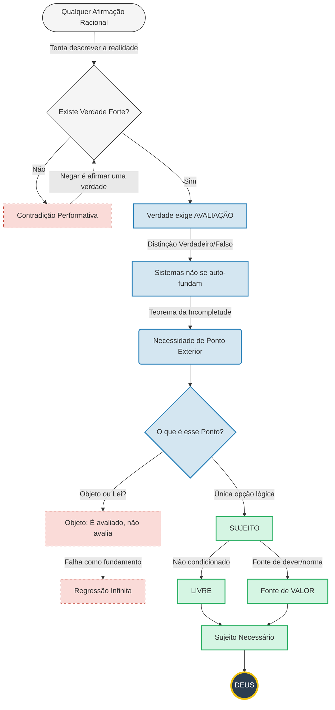

# Aquilo que Avalia sem Ser Avaliado
> Este argumento opera ao **nível meta-ontológico**: não discute verdades dentro de sistemas formais, mas as **condições de possibilidade de qualquer sistema avaliativo**.

### Mapa do argumento

O texto que se segue desenvolve-se em cinco movimentos: (1) estabelece-se o padrão lógico da auto-referência através dos paradoxos clássicos; (2) demonstra-se que este padrão se aplica à própria negação de uma verdade normativa última; (3) deriva-se por necessidade transcendental as características do fundamento que torna a avaliação possível; (4) responde-se às objeções mais frequentes; (5) extraem-se as consequências ontológicas da argumentação.

Comecemos pela genealogia do problema.

## Paradoxo do mentiroso

**Epimenides de Creta** formulou a versão mais antiga deste paradoxo conhecida ao dizer que *"Todos os cretenses são mentirosos"* no século VI a.C., introduzindo o problema da auto-referência normativa.

O paradoxo, enquanto problema lógico explícito, é normalmente atribuído a **Eubúlides de Mileto** no século IV a.C., que o destilou à forma canónica: *"Esta frase é falsa"*.

Esta proposição estabelece-se como paradoxo porque sendo falsa, é verdadeira, e sendo verdadeira, é falsa — com efeito, iguala a própria expressão à sua negação.

**Aristóteles**, em *Metafísica* e *Sobre as Refutações Sofísticas*, sem resolver o paradoxo, estabelece **distinções categoriais fundamentais** que viriam a permitir a análise sistemática destes problemas de auto-referência, nomeadamente a separação entre diferentes níveis de discurso.

Os **estoicos** transformam o problema num **teste rigoroso à coerência da lógica proposicional**, levando-o muito a sério enquanto desafio teórico. Esta atitude motiva a análise refinada da noção de *lekton* (conteúdo dizível), antecipando preocupações modernas com a semântica.

Na Idade Média, lógicos como **Pedro Hispano** e **Guilherme de Ockham** desenvolvem **soluções técnicas** (negação de significação plena, distinções semânticas), tratando o paradoxo como um problema lógico legítimo, não como mero jogo retórico.

No século XX, o paradoxo torna-se central na lógica matemática e nos fundamentos da matemática:

- **Bertrand Russell** identifica nele um **sintoma de inconsistência estrutural** ligada à autoreferência irrestrita, motivando a Teoria dos Tipos.

- **Alfred Tarski** propõe a **hierarquia de linguagens** (objeto vs. metalinguagem) como solução, estabelecendo que a verdade de uma linguagem só pode ser definida numa metalinguagem superior.

- **Kurt Gödel** utiliza uma **estrutura análoga aritmetizada** para provar os teoremas de incompletude, demonstrando que todo o sistema formal suficientemente expressivo contém proposições indecidíveis.

## Halting problem
**Alan Turing** traduz o mesmo esquema para máquinas ao perguntar se:
> Existe um procedimento geral que decide se qualquer programa pára?

A formulação computacional oferece uma vantagem pedagógica: torna explícito o mecanismo de auto-referência num domínio concreto. Vejamos como.

Turing constrói um programa que:

- Consulta esse decisor,
- E faz o oposto do que ele prevê sobre si próprio.

Algo deste género:
```
Q(P) {
    if halts(P, P); then
        loop_forever
    else
        halt
    endif
}
```
Passando depois o próprio programa Q como argumento P, sendo que passamos a ter algo como:
```
Q(Q) faz o contrário de si próprio.
```
Na altura decidiu-se que não pode haver um decisor que consiga determinar se um programa pára ou não, por isto ser paradoxal.
Podemos, no entanto, formular uma versão mais simples do problema:
```
Q(P) {
    return !P(P)
}
```
O que, utilizando notação lógica, revela a estrutura essencial: **Q(P) = ¬P(P)**. A formulação computacional foi sempre uma *ilustração* do padrão lógico subjacente — agora tornado explícito. Se substituirmos *P* por *Q*, obtemos a expressão:

**Q(Q) = ¬Q(Q)**

> **Nota técnica**: Não se trata de um programa executável nem de uma definição computacional literal, mas de um **esquema de diagonalização** — o mesmo padrão lógico usado por Gödel e Cantor. A expressão `Q(Q) = ¬Q(Q)` representa o ponto crítico onde uma função se aplica a si própria, gerando auto-referência paradoxal. Não descreve um processo computável, mas explicita a impossibilidade estrutural de auto-decisão total.

O que importa não é a implementabilidade computacional, mas o padrão lógico subjacente: sempre que tentamos construir um decisor universal que se inclua a si próprio no seu domínio, encontramos contradição.

Aqui ficamos com uma expressão que iguala *algo* ao seu contrário, o que é claramente contradição. Apesar de já não existir um verificador de paragem universal, o paradoxo ressurge. Porquê? Porque surge o mesmo problema:

**A auto-avaliação total, correcta e completa.**

No caso do mentiroso, o critério é **verdade/falsidade**. No caso do halting problem, o critério é **pára/não pára**. Em ambos os casos, quando a função avaliadora é aplicada ao seu **próprio índice**, surge uma contradição.

Este padrão — a impossibilidade de auto-avaliação total — não se limita a problemas computacionais ou lógicos abstractos. Manifesta-se também nas formulações contemporâneas sobre a verdade.

## O Padrão Transcendental: Da Impossibilidade de Auto-Fundação

O que os paradoxos do mentiroso e do halting problem revelam não é uma limitação técnica de sistemas específicos, mas uma **impossibilidade estrutural de todo o sistema auto-avaliativo**. A forma lógica é sempre a mesma: um avaliador que tenta avaliar-se a si próprio no seu próprio domínio gera contradição.

Esta estrutura aplica-se não apenas a sistemas formais, mas a qualquer pretensão normativa. Quando alguém afirma "não existe verdade absoluta" ou "a verdade é subjetiva", está a tentar fundar uma proposição — que nega a possibilidade de fundação — sobre a própria falta de fundamento. A negação da normatividade última é ela própria um ato normativo que se autodestrói.

É este o padrão que vamos seguir: mostrar que a auto-avaliação total é impossível, que toda a avaliação pressupõe um fundamento externo, e derivar as características necessárias desse fundamento.

## Sobre a Verdade Forte

### Definição precisa

Para evitar equívocos, é necessário clarificar o que se entende por **Verdade Forte** neste contexto. O termo não designa:

- Uma teoria semântica particular (correspondência, coerência, pragmática)
- Uma ontologia específica sobre a natureza dos factos
- Uma posição filosófica sobre a acessibilidade ou cognoscibilidade da verdade

**Verdade Forte** designa exclusivamente a seguinte tese:

> **Existe pelo menos uma proposição cuja negação implica contradição performativa** — isto é, cuja negação torna o próprio ato de negá-la incoerente.

Em termos mais simples: há verdades que não podem ser negadas sem que a própria negação se autodestrua. Esta definição é mínima e puramente lógico-transcendental: não afirma *quais* são essas verdades, apenas que *existem* verdades que funcionam como condições de possibilidade do próprio discurso racional.

Com esta clarificação, podemos prosseguir.

## A Contradição Performativa da Negação da Verdade

Tal como **Epimenides de Creta** declarou que "todos os cretenses são mentirosos" (criando paradoxo auto-referencial), a negação contemporânea da normatividade última manifesta-se na proposição: «Não existe Verdade Forte (absoluta)». 

Esta afirmação não é apenas um erro factual, mas uma **aporia performativa** (contradição entre o conteúdo afirmado e o ato de afirmá-lo). Para que a negação seja inteligível e vinculativa, ela teria de habitar a própria 'Verdade Forte' que pretende abolir. O proferimento tenta, assim, suicidar a sua própria condição de validade.

O problema aqui é que a frase também se afirma sobre si própria. Isto é, se não existe verdade, então a própria frase não o pode ser. É a chamada contradição performativa, e uma outra forma (implícita) do **Paradoxo do mentiroso**.

Uma formulação popular desta aporia é a afirmação **"A verdade é subjetiva"**. O erro lógico desta posição é duplo: primeiro, a afirmação pretende ser uma verdade *objetiva* sobre a subjetividade; segundo, ela tenta localizar a autoridade normativa no indivíduo empírico. Ora, o indivíduo, enquanto objeto biológico ou psicológico, é um sistema avaliado por leis (física, biologia, psicologia). Ao dizer que a verdade é subjetiva, o falante tenta atribuir ao 'eu' a função de Sujeito Ontológico — aquilo que avalia — enquanto o mantém simultaneamente como objeto avaliado, resultando no mesmo colapso auto-referencial.

O que implica que o contrário da afirmação (neste caso *"existe verdade objectiva"*) é verdade necessária.

Postula-se pois, pela mesma razão, que **Existe Verdade Forte** é verdade necessária.

**Notas técnicas:**
1. Qualquer crítica a esta conclusão que pretenda validade geral já pressupõe exatamente o tipo de verdade necessária aqui demonstrada, invalidando-se performativamente no próprio acto de formulação.
2. A distinção verdadeiro/falso é já uma **distinção normativa mínima** — algo deve ser afirmado e algo rejeitado — pelo que todo fundamento da verdade é, por necessidade lógica, também fundamento da normatividade.
3. "Verdade Forte" não designa uma teoria semântica específica, mas a impossibilidade de eliminar a distinção normativa verdadeiro/falso sem incoerência performativa. O argumento é independente de qualquer análise particular da verdade, pois **toda análise já pressupõe um critério normativo de correção**.
4. O termo "necessário" é aqui usado num sentido estrito: aquilo cuja negação implica **contradição performativa** ou impossibilidade de discurso normativo coerente — não necessidade psicológica nem meramente formal, mas necessidade ontológica mínima exigida pela possibilidade de avaliação racional.
5. Alguns filósofos negam que a contradição performativa seja refutação decisiva, argumentando que podemos distinguir entre o *conteúdo* de uma afirmação e o *ato* de a afirmar. Contudo, esta objeção só é relevante quando o conteúdo pode ser avaliado independentemente do acto. No caso presente, o conteúdo *é* precisamente sobre a possibilidade de avaliação normativa — não há instância externa que possa validar a negação sem já pressupor a normatividade que nega. A tentativa de fugir à contradição ao refugiar-se numa posição "meramente descritiva" ou "atitudinal" equivale a abandonar a pretensão de validade geral, convertendo a objeção em silêncio.

## Sobre o fundamento da verdade

O fundamento da verdade de um sistema tem que ser externo a esse sistema. A auto-fundação não é sustentável.

> A hipótese de um “facto bruto” último não resolve o problema do fundamento. Um facto bruto pode interromper perguntas causais, mas não **fundamenta normatividade**. Um fundamento que não explica por que a avaliação é válida não a funda — apenas suspende a exigência racional, o que equivale a abdicar da própria noção de fundamento.

Aqui questiona-se: **não são sistemas que regem o mundo material?** E responde-se: regem-no enquanto **mecanismos de funcionamento**, mas não enquanto **fundamentos de validade**. Um sistema físico descreve a regularidade de um processo; ele não fundamenta a 'correção' da sua própria existência nem a obrigatoriedade da sua inteligibilidade. Confundir a *regularidade descritiva* (o modo como as coisas funcionam) com a *soberania normativa* (o porquê de o sistema ser verdadeiro) é um erro categorial: o funcionamento é um **dado**, o fundamento é uma **condição**.

Isto implica que **há fundamento que o transcende**, e é, sem sombra de dúvida, **incontornável sem cair no absurdo**. Isto é, **tem de haver fundamento último externo a todo e qualquer sistema.**

Apenas por necessidade lógica, pretendemos derivar as características necessárias deste fundamento.

## Características necessárias do fundamento último

A derivação que se segue não é arbitrária: cada característica resulta da **negação de uma forma específica de dependência** que geraria regressão, circularidade ou subordinação a algo mais fundamental. O método é apofático (via negationis): define-se o fundamento não pelo que ele é, mas pelo que ele não pode ser sem deixar de ser fundamento.

As 21 características podem ser consolidadas em sete princípios fundamentais:

### 1) Não pode ser sistémico nem formalizável
> Todo sistema pressupõe regras e domínio; axiomas valem dentro de estruturas formais. O fundamento não pode depender de uma estrutura prévia, senão colapsaria em circularidade. Se fosse exaustivamente formalizável, tornar-se-ia objeto avaliável e voltaria a ser sistema, gerando contradição auto-referencial.

### 2) Não pode ser contingente nem derivado
> Se pudesse não existir ou fosse deduzido de algo mais básico, esse algo seria o verdadeiro fundamento. Se tivesse causa, essa causa seria mais fundamental.

### 3) Não pode ser condicionado nem relativo
> Qualquer condição que limitasse o fundamento funcionaria como fundamento superior. Se variasse por perspectiva ou sistema, deixaria de fundamentar todos os sistemas.

### 4) Deve ser anterior à distinção verdadeiro/falso
> A própria distinção pressupõe algo que a torne possível, precedendo-a para evitar que a dualidade se fundamente a si própria de forma paradoxal.

### 5) Deve ser atemporal e incondicionado
> A situação temporal implica sucessão e submissão à causalidade. O fundamento deve possuir **anterioridade ontológica**, sendo a condição de possibilidade da própria sucessão temporal.

### 6) Deve ser uno e universal
> Se tivesse partes, exigiria um princípio de unidade mais fundamental. Um fundamento particular não poderia fundamentar universalmente.

### 7) Deve ser livre e pessoal
> A normatividade não é mera estrutura descritiva, mas **autoridade prescritiva**. Estruturas descrevem regularidades; autoridade discrimina o que deve ou não deve ser afirmado. Prescrição sem fonte de autoridade é um erro categorial. Factos apenas *são*; a Verdade *exige*. Como a exigência de correção não pode emanar da passividade de um objeto, o fundamento tem de ser a instância ativa da distinção — o que define a função ontológica de **Sujeito Originário**.

Estas características negativas estabelecem o que o fundamento não pode ser. Mas resta mostrar por que o fundamento tem de ser *pessoal* — isto é, um Sujeito — e não meramente uma estrutura impessoal.

As exclusões são particularmente decisivas: se o fundamento não pode estar em relação de dependência, não pode não ser livre, e não pode ser impessoal, então ele não pode consistir em mera regularidade ou lei. A liberdade e a independência absoluta excluem o mecanismo; a autoridade normativa exige agência.

**A normatividade não é uma propriedade emergente da complexidade** — um milhão de factos brutos continuam a ser apenas 'dados' passivos; nenhum acúmulo de informação produz a qualidade da *vinculação*. Regras e factos podem especificar condições de validade, mas não explicam por que essas condições são **racionalmente obrigatórias**. A forma lógica de uma regra não gera autoridade normativa; a existência de um facto não impõe obrigação racional de aceitá-lo.

Se existe distinção correcto/incorreto com pretensão de validade geral, então existe uma **fonte de normatividade** cuja autoridade não deriva de qualquer regra, estrutura ou critério externo. O que aqui se afirma não é a introdução de uma entidade adicional, mas a identificação de uma **condição de possibilidade** da normatividade enquanto tal.

Qualquer fundamento que satisfaça estas condições exerce funcionalmente o papel mínimo exigido para que a avaliação normativa com validade geral seja possível.

## Definição (Sujeito mínimo)
Qualquer instância que exerça avaliação normativa vinculativa, sem derivar essa autoridade e sem estar subordinada a outra, desempenha funcionalmente aquilo que a tradição ontológica denomina **Sujeito** — não no sentido psicológico ou fenomenológico, mas como função ontológica mínima de autoridade normativa.

Designamos por **Sujeito** o *locus* da **Agência Normativa Não-Derivada**. Esta função não descreve uma psique ou um ego empírico, mas a **necessidade transcendental de um Avaliador que não é passível de avaliação**. Na gramática do ser, se o objeto é o que é 'posto' (*ἀντικείμενον* — aquilo que se opõe, que é colocado diante), o Sujeito é o que 'sustenta' (*ὑποκείμενον* — aquilo que subjaz, que serve de fundamento) a validade do que é posto.

O termo remete à tradição clássica aristotélica do *ὑποκείμενον* (Metafísica, Ζ): não a consciência representacional cartesiana, mas a condição de possibilidade da determinação normativa. A oposição entre *subjectum* e *objectum* é assimétrica — o objeto é posto; o Sujeito sustenta a possibilidade da relação.

Recusar o termo enquanto se aceita a função é nominalismo irrelevante; o compromisso ontológico com uma Agência Transcendental já foi consumado pela lógica do argumento. Introduzir a designação não acrescenta conteúdo, apenas nomeia a necessidade estrutural já demonstrada.

Os atributos positivos que se seguem não são propriedades adicionadas arbitrariamente, mas **formulações afirmativas das exclusões lógicas previamente estabelecidas**. Cada atributo corresponde à negação de uma forma de dependência, limitação ou contingência. Não se trata de acumulação ontológica, mas de depuração lógica.

## Sobre a Alegada Falibilidade do Argumento

Antes de formular as conclusões, convém responder à objeção central que geralmente se levanta contra este tipo de argumento transcendental.

Todas as objeções que pretendem validade geral sem abdicar da normatividade — apesar de variarem no vocabulário — reduzem-se, em última análise, a **uma única estratégia**: a alegação de que a conclusão **não é logicamente necessária**. As restantes objeções não são independentes, mas **variações derivadas** dessa mesma confusão de níveis.

### A objeção central: "não é logicamente necessário"

Esta objeção sustenta que, mesmo concedendo os limites da auto-referência e da auto-fundação, **não é dedutivamente forçado** concluir a existência de um fundamento último com as características derivadas.

O erro aqui é técnico e decisivo:
o argumento **não opera ao nível da dedução lógico-formal**, mas ao nível **transcendental** — isto é, analisa não as conclusões que se seguem de premissas, mas as condições de possibilidade para que premissas e conclusões façam sentido.

A questão não é o que pode ser formalmente derivado a partir de premissas neutras, mas:

> **O que tem de ser o caso para que avaliação racional, crítica válida e objeção com pretensão universal sejam possíveis?**

Qualquer tentativa de negar a conclusão:

* pretende validade geral,
* distingue correto/incorreto,
* e exige que a sua negação seja racionalmente vinculativa.

Ao fazê-lo, **já exerce exatamente o tipo de normatividade** cuja possibilidade está em causa no argumento.

Se a objeção abdicar dessa pretensão — tornando-se local, contingente ou meramente atitudinal — deixa de ser objeção racional e passa a ser apenas ruído subjetivo. Se a mantiver, **ela confessa a sua dependência**: o crítico tenta usar a autoridade da lógica para negar a autoridade do fundamento da lógica. É uma tentativa de suicídio intelectual: o crítico só consegue formular a negação porque o fundamento que ele nega lhe fornece os instrumentos de validade para o fazer. Não existe terceira via estável.

### Nota sobre as objeções derivadas

As alegadas "alternativas normativas impessoais" e a crítica do "salto ilegítimo para o Sujeito" não introduzem dificuldades adicionais. Ambas pressupõem precisamente aquilo que a objeção central tenta negar: a possibilidade de normatividade vinculativa com validade geral.

A primeira confunde **condições de funcionamento** com **condições de validade**, e a segunda confunde **nomeação funcional** com **acréscimo ontológico**.

Em ambos os casos, o erro só parece plausível enquanto se ignora o nível transcendental em que o argumento opera.

## Conclusão

### Primeira parte
Da impossibilidade de auto-fundação, regressão infinita e relativização normativa, segue-se necessariamente a existência de um fundamento último com as seguintes características mínimas:
- não derivado
- não sistémico
- normativamente autoritativo
- transcendente a qualquer estrutura formal
- condição de possibilidade da distinção correcta/incorreta

Negar este resultado implica abdicar da possibilidade de crítica racional com validade geral.

### Segunda parte
A partir deste fundamento mínimo, e analisando o que ele **não pode ser** sem colapsar nas contradições previamente excluídas, derivam-se atributos adicionais tradicionalmente associados ao fundamento último (unidade, simplicidade, eternidade, etc.).

Estas derivações não introduzem novos princípios, mas explicitam consequências lógicas da ultimidade já estabelecida.

### Terceira parte: A identificação do fundamento como Divindade

A identificação deste fundamento como **Deus** constitui talvez o passo mais controverso do argumento, merecendo atenção cuidadosa. Não se trata de um salto fideísta nem de uma imposição religiosa arbitrária, mas de uma **identidade semântica necessária**.

Com efeito, se o fundamento último é:
- **não derivado** (não depende de nada mais)
- **não sistémico** (transcende toda a estrutura formal)
- **normativamente autoritativo** (fonte da vinculação racional)
- **anterior à distinção verdadeiro/falso** (condição de possibilidade da avaliação)
- **livre e pessoal** (agência não condicionada)
- **uno e universal** (fundamenta toda a realidade)
- **atemporal e necessário** (não depende de condições espaço-temporais)

Ora, estas não são propriedades arbitrárias escolhidas por conveniência teológica. São precisamente as características que a tradição ontológica ocidental — de Platão a Aristóteles, de Agostinho a Tomás de Aquino, de Descartes a Leibniz — tem associado ao conceito de **Divindade** precisamente porque são as características que um fundamento último *deve* ter para cumprir a sua função.

No léxico da Ontologia Fundamental, o 'Sujeito absoluto, necessário, simples e fonte de toda a normatividade' não é uma descrição entre outras possíveis — é a **definição exaustiva** de Divindade. As definições tradicionais de Deus como "Aquele que é" (Êxodo 3:14), como "o ser notwendig" de Leibniz, como o "actus purus" de Tomás de Aquino, ou como a "substância infinita" de Spinoza, são todas tentativas diferentes de articular as mesmas características negativas e positivas que derivamos por necessidade transcendental.

A relutância em usar o termo "Deus" não altera a estrutura da realidade revelada: quem aceita a necessidade de um fundamento último e pessoal para a verdade, já está a descrever — mesmo que recuse nomeá-lo — aquilo que a tradição ontológica denomina Divindade. Usar outro nome para esta função não a torna menos divina; a recusa do termo é meramente nominal e não altera o compromisso ontológico assumido.

Importa distinguir esta conclusão de duas posições diferentes:
- O **teísmo** afirma que este fundamento é uma pessoa no sentido ordinário, com consciência, vontade e relações (como o Deus bíblico). O argumento transcendental não chega a tanto — não demonstra atributos como onisciência, onipotência ou benevolência.
- O **panteísmo** identifica o fundamento com o universo ou a natureza. Mas o universo é contingente, composto, e está no tempo — todas características que o argumento exclui.

O que o argumento demonstra é mais próximo do **teísmo transcendental** ou **deísmo filosófico**: a necessidade lógica de uma instância última que possui as características formais tradicionalmente associadas à divindade, sem comprometer a questão de saber se essa instância possui atributos pessoais no sentido teológico específico.

Recusar a designação "Deus" é legítimo como preferência terminológica, mas não altera o facto de que o argumento demonstra — por necessidade transcendental — a existência de algo que satisfaz a definição funcional de Divindade.

Em suma, abdicar da validade geral não é uma opção intelectual — é o silenciamento da razão. Quem renuncia ao fundamento último renuncia à capacidade de distinguir o argumento do ruído, a crítica da força, e a verdade do delírio. Fora desta estrutura, o discurso não se torna 'livre' ou 'plural' — torna-se estritamente **impossível**.

**O argumento repousa sobre uma Tríade de Necessidade:**
1. **Lógica:** A auto-referência total sem fundamento externo gera paradoxo.
2. **Transcendental:** A normatividade exige uma autoridade que não seja um objeto avaliado.
3. **Ontológica:** O fundamento desta autoridade tem de ser um Sujeito Livre e Necessário.

## Diagrama lógico


## Vídeo explicativo

Para uma apresentação audiovisual deste argumento com exemplos adicionais e diagramas animados, consulte:

[Assistir vídeo explicativo](https://tty.pt/maquina.mp4)
